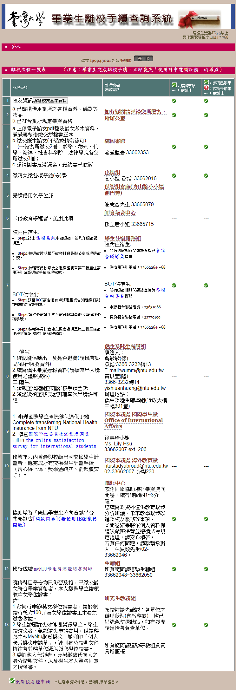

# 台大電子所ICS組博班畢業之路

### 目錄
1. [簡介](#簡介)
1. [課程學分規定](#課程學分規定)
1. [資格考](#資格考)
1. [申請畢業論文口試](#申請畢業論文口試)
1. [論文口試](#論文口試)
1. [離校手續](#離校手續)

### 簡介
* 本文主要根據「[台大電子所修業相關資訊](http://www.giee.ntu.edu.tw/portal/student_lect.php)」編訂而成。根據本文將所有步驟完成後，即可得到台大博班畢業證書。
* 由於電子所規定每年可能略有不同，因此建議同學**在學期開學前再次確認本文是否需要更新**。
* 電子所最新相關文件[下載處](http://cc.ee.ntu.edu.tw/~giee/announce/download.htm)。

### 課程學分規定
* **一般生**應修最低畢業學分數為**18學分**，並應修習本組課程至少**9學分**；學士及碩士**逕修博士生**則為**36學分**，應修習本組課程至少**18學分**。至於本組課程之定義則由指導教授就其專業領域之需求認定（此處學分數不包含**專題討論**、**專題研究**、**專題演講一**、**專題演講二**、**論文**及**外國語文**）。請注意大學部（U字頭以外）課程之學分不計入應修最低畢業學分數內。除了以上規定學分外，還需修習以下課程：

    | 課程編號  |  科目名稱  | 學分 |                    備  註                        |
    |:---------:|:----------:|:----:|--------------------------------------------------|
    | 943 D0010 |  博士論文  |      | 學位考試成績佔畢業總成績之1/2                    |
    | 943 D0020 |  專題討論  |   0  | 已修畢(且通過)**六學期**以上者得免修             |
    | 943 D0030 |  專題研究  |   1  | 在學期間每學期必修（惟**畢業離校當學期得免修**） |
    | 943 D0040 | 專題演講一 |   1  | 必修一學期                                       |
    | 943 D0050 | 專題演講二 |   1  | 必修一學期                                       |

* 若讀博之前曾經超修研究所課程的同學可填寫[抵免學分申請書](http://cc.ee.ntu.edu.tw/~giee/announce/download/c21_waive.doc)（另需上網登錄）。
    
* 博士生依本校交換計畫申請出國交換，或申請到科技部、教育部之補助 出國進修，或經指導教授安排出國進行研究交流，達學期授課時數三分 之一（六週）者，得於出國前或返國後修習補足**專題討論**；達學期授 課時數三分之二（十二週）者，得免修當學期之**專題討論**，但需於返 國後該學期提出相當於**專題討論**課程免修習次數之書面或口頭心得報 告（由專題討論授課教師決定）。前述皆需提出申請，經指導教授及所長同意，並知會專題討論授課教師。

### 資格考
* 資格考分為**基本科目**與**本所科目**二類，考生須依各組規定從各科目中選擇若干門課程應考，合計應考五門，但所選課程得不受限於已修習過的。

* **基本科目**須選考二門，計有四門可以選考（分數計算公式另訂）：
    1. 工程數學：線性代數、微分方程、離散數學、複變、機率與統計（五選二）
    1. 電路學及信號與系統
    1. 電子學
    1. 計算機科學：演算法、計算機概論、資料結構（三選二）

* **本所科目**須選考三門，並限**電子所課表五年內科目**。

* **基本科目**考試一律不得攜帶參考資料，**本所科目**則另行規定，試卷採彌封方式。不依規定，擅自記名或任意塗改毀損者不予記分。

* 考試成績送招生及學術委員會作為審查基本資料，通過與否，由招生及 學術委員會審查決定，經招生及學術委員會審查未通過者必須重考。重考得 於一學期後提出申請，以一次為限，選考課程得改變。重考後仍未通過者即 造冊送研教組公告退學。全部考試必須於進入博士班後四個學期以內通過 （不包含休學期間），但經各組及所長認定須補修大學部學分超過九學分者 （含）得延長資格考試年限為三年。筆試平均成績達七十分，且無三門（含） 以上未達七十分者則審查通過。

* 博士班學生具下列二項條件者，經指導教授同意後，得為**博士候選人**：
    1. 完成博士學位**應修課程**。
    1. 通過博士學位**資格考**。

### 申請畢業論文口試
* 論文口試**申請期限**上學期為**11月30日**，下學期為**4月30日**。申請條件為：
    1. 已成為**博士候選人**。
    1. **論文點數**達標。（請參考[博士論文計點辦法](http://cc.ee.ntu.edu.tw/~giee/regulation/01_4_PhDPaperPoints_10601.pdf)，並注意**電子所**有項**內規**是必須至少要有一篇[**傑出期刊**](http://app.bebi.ntu.edu.tw/doc/download/105%e5%b9%b4%e5%ba%a6%e5%82%91%e5%87%ba%e6%9c%9f%e5%88%8a%e8%ab%96%e6%96%87%e6%b8%85%e5%86%8a(%e4%be%9d%e5%88%8a%e5%90%8d%e5%ad%97%e6%af%8d%e6%8e%92%e5%ba%8f).pdf)或[**優良期刊**](http://app.bebi.ntu.edu.tw/doc/download/105%e5%b9%b4%e5%ba%a6%e5%84%aa%e8%89%af%e6%9c%9f%e5%88%8a%e8%ab%96%e6%96%87%e6%b8%85%e5%86%8a(%e4%be%9d%e5%88%8a%e5%90%8d%e5%ad%97%e6%af%8d%e6%8e%92%e5%ba%8f).pdf)之論文，但若已獲得本所[學生傑出研究獎](http://cc.ee.ntu.edu.tw/~giee/announce/download/f01_outstanding.doc)者可無視此內規。）
* 預定畢業同學，選課時務必選**博士論文**（課程編號為943 D0010）。若不幸忘了選，請洽詢研教組補選。
* 請於**申請期限內**、**口試前一個月**繳交下列資料至所辦，以辦理學位考試申請手續：
    1. [學位考試申請書](http://my.ntu.edu.tw/)（請至myNTU填寫列印，需**指導教授**簽章）
    1. [成績審核表](http://cc.ee.ntu.edu.tw/~giee/announce/download/g01_check_phd.doc)（需**指導教授**簽章）
    1. 歷年成績單（請自行至**研教組**申請）
    1. [博士論文研究說明書](http://cc.ee.ntu.edu.tw/~giee/announce/download/h01_PhDThesisDescription.doc)
    1. 候選人正式發表之論文刊登本（如無刊登本，亦可用投稿本，但須附接受函）
    1. 候選人履歷表（無格式限制）
    1. [博士申請畢業指導教授推薦函](http://cc.ee.ntu.edu.tw/~giee/announce/download/h02_PhDRecommendLetter.doc)
    1. [博士學位口試著作列表](http://cc.ee.ntu.edu.tw/~giee/announce/download/h04_PhDPublicationList.doc)
    1. 論文初稿（或大綱）
    1. [口試委員名冊](http://cc.ee.ntu.edu.tw/~giee/announce/download/g02_committee_phd.doc)（最遲請提前於**口試前兩週**送交所辦）
    1. [電子所博士學位口試演講公告](http://cc.ee.ntu.edu.tw/~giee/announce/download/h03_PhDAnnounce.ppt)（非必要，若選擇公告則需繳一本**論文初稿**給所辦）
* 若畢業關鍵之期刊論文已拿到Minor Revision的審核結果，可申請[論文點數預核](http://cc.ee.ntu.edu.tw/~giee/announce/download/h05_credit.doc)提早口試。
* 如擬提前於學期中口試，並於學期中辦理離校手續者，需另附[提前畢業未修學分證明](http://gra103.aca.ntu.edu.tw/gra2007/gra/tienn/%E5%AD%B8%E4%BD%8D%E8%80%83%E8%A9%A6%E8%A1%A8%E5%86%8A/GRANOCREDIT.doc)，並請勿選專題討論及專題研究課程。（僅限確定要提前離校者）。若已選論文以外其他課程、又確定需提前離校者，需再另附[提前畢業註銷當學期修課申請書](http://gra103.aca.ntu.edu.tw/gra2007/gra/wu/delcurcou.doc)。

### 論文口試
* 口試前準備工作：
    1. 盡早邀約口委，詢問口委們可出席的時間並找出交集（推薦使用Google表單，可參考此[範本](https://goo.gl/forms/G67tAkNh5BzhgggY2)），或是使用 doodle
    1. 完成[**博士論文**](https://github.com/mediaic/NTU_PhD_Dissertation)，並印製**平裝版**論文初稿給自己、老師與口委們（若口試有選擇公告的話需再多印一本給所辦）
    1. 製作口試投影片、並安排實驗室內部之口試Rehearsal
    1. 借口試教室
    1. 張羅當日口委之**飲料**與**點心**（陋習）
    1. **口試前一日**至電子所辦公室領取**口試委員審查費領據**
    
* 口試當日需攜帶：
    1. [口試委員審定書](https://github.com/mediaic/NTU_PhD_Dissertation/raw/master/doc/Approval.docx)（即論文簽名頁）
    1. [學位論文考試評分表](http://cc.ee.ntu.edu.tw/~giee/announce/download/g03_thesis%20grade.doc)（口試委員一人一份，包含指導教授，需要口委簽名）
    1. [學位考試紀錄表](http://cc.ee.ntu.edu.tw/~giee/announce/download/g03_oral%20record.doc)（一份，需要所有口委簽名）
    1. 口試委員審查費領據（需要口委簽名）
    1. 論文初稿
    1. 紙本投影片（口試委員一人一份，包含指導教授）
    1. 口委之**飲料**與**點心**（陋習）
    1. 一名幫忙做**口試紀錄**之同學（[口試紀錄範本](./doc/defense_record.docx)）

* 口試後收官：
    1. 依照口委建議修改論文
    1. 在老師將[**口試紀錄**](./doc/defense_record.docx)、[**口試委員審定書**](https://github.com/mediaic/NTU_PhD_Dissertation/raw/master/doc/Approval.docx)、[**學位論文考試評分表**](http://cc.ee.ntu.edu.tw/~giee/announce/download/g03_thesis%20grade.doc)、[**學位考試紀錄表**](http://cc.ee.ntu.edu.tw/~giee/announce/download/g03_oral%20record.doc)、**口試委員審查費領據**交給所辦、所辦確認沒問題後會請**所長**簽名，簽名完後的[**口試委員審定書**](https://github.com/mediaic/NTU_PhD_Dissertation/raw/master/doc/Approval.docx)需放在終版論文裡。
    1. 完成最終版論文後，請至[**電子學位論文服務系統**](http://etds.lib.ntu.edu.tw/etdsystem/submit/submitLogin)上傳電子學位論文請圖書館審核，確認審核過後再印製論文（詳細流程可參考圖書館之[**畢業離校及論文繳交**](http://www.lib.ntu.edu.tw/node/103)）。除了論文本體之PDF檔之外，還需上傳[**大綱**](./doc/Outline.txt)、[**關鍵字**](./doc/Keyword.txt)、[**參考文獻**](./doc/Reference.txt)等文字檔；參考文獻文字檔中每條line代表一文獻，**不需再另加文獻編號**（上傳後[**論文系統**](http://www.airitilibrary.com/Search/alThesisbrowse?FirstID=U0001&type=Dissertations&changeColor=CU0001)會自動插入編號）。**電子論文審核需兩個工作天**。
    1. 印製**黑底**燙金之**精裝版**論文終稿（圖書館需兩本，指導教授一本，實驗室一本，自己一本，因此最少需印**五本**），**精裝版論文印製工作需要三個工作天**（不含送件當日，不含假日）
    1. 繳交兩本畢業論文至台大總圖
    1. 完成[**實驗室畢業生檢查清單**](./doc/mediaic_check_list.docx)後交與老師
    1. 完成[**電子所畢業生離校手續單**](http://cc.ee.ntu.edu.tw/~giee/announce/download/g21_leave.doc)後交至所辦
    
### 離校手續
* 前往myntu之[畢業生離校手續查詢](https://my.ntu.edu.tw/StudLeave/Login.aspx)確認所有**綠色勾勾**皆已亮起（除了第十三項之外，請見下圖）
* 學生證壓註失效後即可得到畢業證書，之後便可免費申請辦理**校友證**（可於[畢業生離校手續查詢](https://my.ntu.edu.tw/StudLeave/Login.aspx)最下方處點選申請）

    
